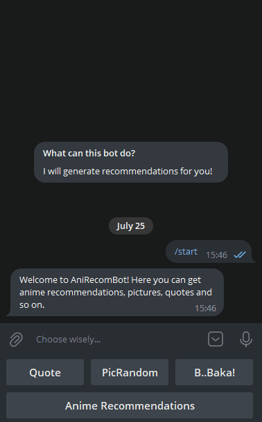

# AniRecomBot

The bot generates a list of recommendations based on the MyAnimeList account.
Recommendations are obtained through scraping from this site: https://anime.ameo.dev/

The bot can also show a random quote, picture or gif using various APIs.

You can check out the bot here: https://t.me/anirecombot



## Usage

The bot executes all commands using the corresponding buttons in the menu.

- `Quote` - Random quote.
- `PicRandom` - Random picture.
    - `SFW`
        - `Get picture`
    - `NSFW`
        - `Get picture`
    - `I WANT EVERYTHING!`
        - `Get SFW pic`
        - `Get NSFW pic`
- `B..baka!` - Random "baka" gif.
- `Anime Recommendations` - Recommendations. When clicked, it will ask for a nickname for "MyAnimeList". Has its own
  submenu:
    - `Next` - Show next recommendation.
    - `Update recs` - Update list of recommendations.
    - `Main Menu` - Return to the main menu.

## Getting started

Commands in this instruction are provided for Linux. If you are using Windows, you can find similar commands in the
command block (under the step-by-step instructions) after the '#' comment marker.

Also, if you want to create a loading animation, then send the bot a GIF and insert the received file_id into 
the animation parameter in `handlers/ani_recomms.py:48`, then uncomment the lines.

0. You must have firefox installed.
1. Clone this repository to your local machine.
2. Create a virtualenv (This step is optional, but highly recommended to avoid dependency conflicts)
   `python3 -m venv .venv` (You don't need to run it again)
   `. .venv/bin/activate` (You must run this every time you open the project in a new shell)
3. Install requirements.
4. Create an `.env` file in the root of project directory (there is a `.envExample` file for you to use as a template.) and add your Telegram bot API token https://t.me/BotFather
   `BOT_TOKEN=bot-token-here`
5. Run `bot.py` from project directory.
    `python3 -m anirecombot.bot`

```shell
$ git clone https://github.com/GSPVK/AniRecomBot/
$ cd AniRecomBot
$ python3 -m venv .venv # on windows run "py -m venv .venv"
$ . .venv/bin/activate # on windows run ".venv/Scripts/activate"
(.venv) $ pip install -r requirements.txt
# Create a .env file, as described in step 4
(.venv) $ python3 -m anirecombot.bot # on windows run "py -m anirecombot.bot"
```
